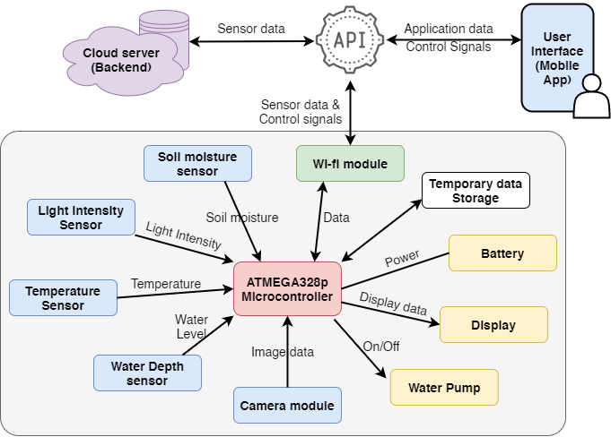

[comment]: # "This is the standard layout for the project, but you can clean this and use your own template"

# Smart Plant Pot

---

## Team
-  E/18/154, Jayasumana C.H. [email](mailto:e18154@eng.pdn.ac.lk)
-  E/18/349, Thalisha W.G.A.P. [email](mailto:e18349@eng.pdn.ac.lk)
-  E/18/327, Senevirathna M.D.C.D. [email](mailto:e18327@eng.pdn.ac.lk)

<!-- Image (photo/drawing of the final hardware) should be here -->

<!-- This is a sample image, to show how to add images to your page. To learn more options, please refer [this](https://projects.ce.pdn.ac.lk/docs/faq/how-to-add-an-image/) -->

<!--  -->

#### Table of Contents
1. [Introduction](#introduction)
2. [Solution Architecture](#solution-architecture )
3. [Hardware & Software Designs](#hardware-and-software-designs)
4. [Testing](#testing)
5. [Detailed budget](#detailed-budget)
6. [Conclusion](#conclusion)
7. [Links](#links)

## Introduction

Taking care of plants can be largely time consuming. Missing even a small scheduled task to the plant can result in drying up of the plant or even its death. Watering the plant, checking the amount of moisture in the soil are another very important and time consuming tasks. Another big problem in the houses(apartments) is the space.

But with the busy lifestyle people have less time and they don’t tend to plant trees and take care of them. As a solution to this problem, we are producing this smart pot to promote the concept, “plants as pets”. And this smart pot is also ideal for gardeners who are interested in planting plants like Bonsai where special conditions are needed.

## Solution Architecture

  
</ p>
 

## Hardware and Software Designs

Detailed designs with many sub-sections

## Testing

Testing the API stepwise using Postman

## Detailed budget

All items and costs

| Item          | Quantity  | Unit Cost (LKR)  | Total (LKR)  |
| ------------- |:---------:|:----------:|-------:|
| Arduino Uno board   | 1         | 10.00    | 50.00 |
| Water level sensor depth detection| 1 | 120.00 | 120.00|
| Capacitive soil moisture sensor | 1 | 400.00 | 400.00|
|LDR light sensor| 1 | 200.00 | 200.00 |
|1.8 - inch 128x160 SPI TFT LCD Display mode | 1 | 1800.00 | 1800.00|
| Serial WIFI Wireless Module | 1 | 550.00 | 550.00 |
| DS18B20 Digital Temperature Sensor Probe | 1 | 400.00 | 400.00 |
| Water Pump | 1 | 450.00 | 450.00|
| OV7670 Camera Module for Arduino | 1 | 960.00 | 960.00 |
|12V 2500mAh Rechargeable Lipo Battery | 1 | 3300.00 | 3300.00|
| Wires and other | | | 1000.00|
| Total |||12980.00|
## Conclusion

What was achieved, future developments, commercialization plans

## Links

- [Project Repository](https://github.com/cepdnaclk/e18-3yp-Smart-Plant-Pot)
- [Project Page](https://cepdnaclk.github.io/{{ page.repository-name}})
- [Department of Computer Engineering](http://www.ce.pdn.ac.lk/)
- [University of Peradeniya](https://eng.pdn.ac.lk/)

[//]: # (Please refer this to learn more about Markdown syntax)
[//]: # (https://github.com/adam-p/markdown-here/wiki/Markdown-Cheatsheet)
